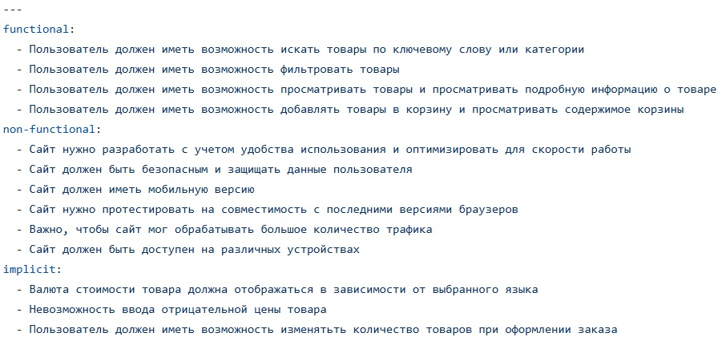
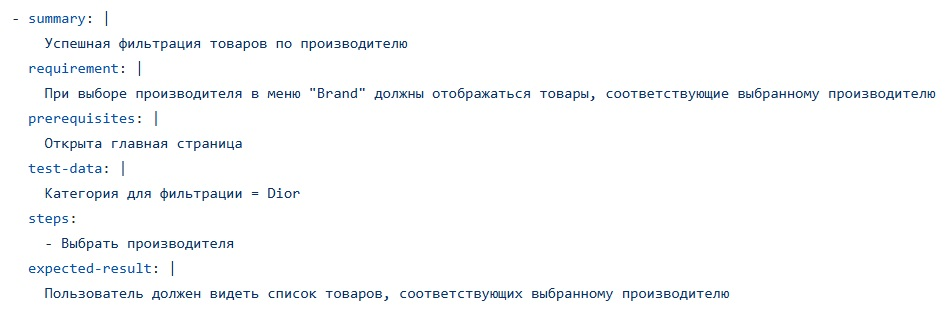
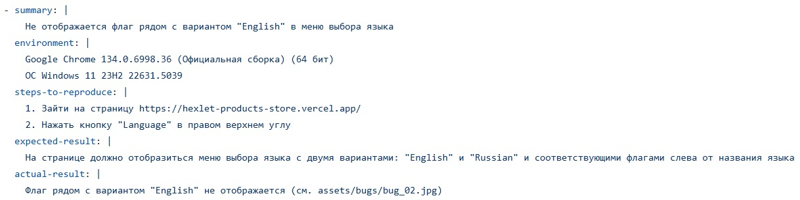
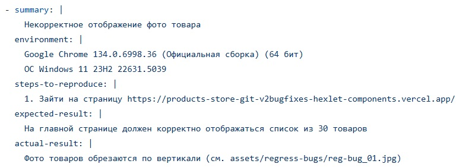

### Hexlet tests and linter status:

# Testing an online store

## Description

The project involves testing an online store.

In the tested online store, the customer can:

- View the product catalog
- Filter products by specified attributes
- Add products to the cart or remove them
- Create an order

The website testing is carried out in several stages:

- Reviewing the list of website requirements
- Conducting test analysis and identifying missing requirements
- Formulating implicit requirements and adding them to the list
- Creating a test plan
- Performing test design and writing test cases according to the plan
- Conducting testing
- Performing regression testing
- Preparing a bug report and a test report

## Demonstration:

- Requirements list:

  

---

- Test-cases list:

  

---

- Testing report:

  

---

- Bug report:

  

---

- Regress report:

  

---

### Click [here](https://hexlet-products-store.vercel.app/) to view the first version of online store.

### Click [here](https://products-store-git-v2bugfixes-hexlet-components.vercel.app/) to view the second version of online store.
